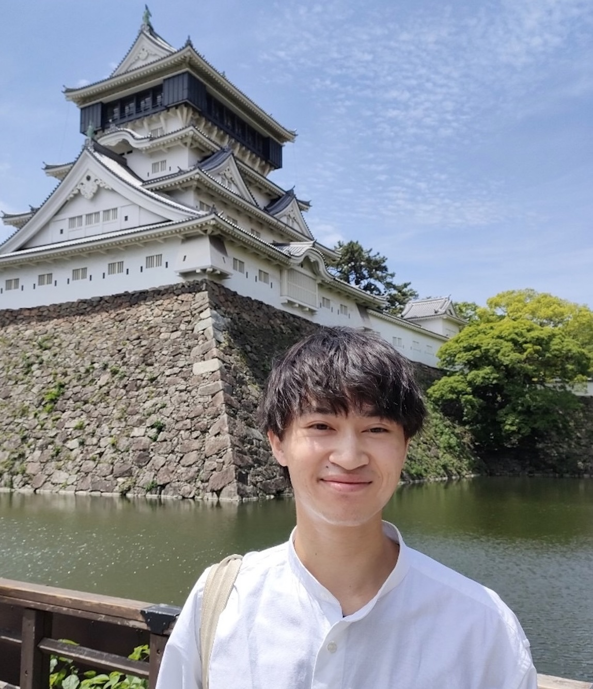

{width="200px" fig-align="left"}

# Yusuke Inoue (井上　裕介)

博士課程学生(日本学術振興会特別研究員DC1)

〒606-8502　京都市左京区北白川追分町　京都大学理学部宇宙物理学教室 [Website](https://www2.kusastro.kyoto-u.ac.jp/ja/)

Email: yusuke[at]kusastro.kyoto-u.ac.jp

---

# Education
- 2025/03 京都大学 理学研究科 物理学・宇宙物理学専攻 宇宙物理学教室 修士課程終了
- 2023/03 京都大学 工学研究科 工業化学科 学士課程終了
- 2019/03 福岡県立東筑高等学校 卒業

---

# Fellowships & Research grants
1. Research Fellowships of the Japan Society for the Promotion of Science for Young Scientists DC1, FY2025 - FY2027, JPY 2,400,000 [link](https://kaken.nii.ac.jp/ja/grant/KAKENHI-PROJECT-25KJ1472/)
1. Hayakawa Satio Fund awarded by the Astronomical Society of Japan, FY2024, JPY 412,449 [link]((https://www.asj.or.jp/jp/activities/expenses/hayakawa_fund/recipients/2024/))
1. DoGS Overseas Travel Support Program awarded by Kyoto University, FY2023, JPY 400,000 [link](https://www.kugd.k.kyoto-u.ac.jp/office/dogs2023_02_houkoku)

---

# Memberships
- 日本天文学会 [link](https://www.asj.or.jp/jp/)

---

# Professional Services
- レフェリー, Monthly Notices of the Royal Astronomical Society [link](https://academic.oup.com/mnras)
- 現地実行委員会, The Next Decade of Supernova Science: Bridging Theory and Observation, Kyoto University, Kyoto, Japan, 2026 [link](https://sites.google.com/view/nextdecadeofsnscience/registration?authuser=0)
- 事務局, 第55回天文・天体物理若手夏の学校, ホテル圓山荘, 長野, 2025 [link](https://astro-wakate.sakura.ne.jp/ss2025/staff/)
- 座長団, 第54回天文・天体物理若手夏の学校, 賢島 宝生苑, 三重, 2024 [link](https://astro-wakate.sakura.ne.jp/ss2024/session/)

---

# Teaching experience
#### Teaching assistant
- Electromagnetics (Kyoto University, Fall 2024)
- Theoretical Astronomy Seminar (Kyoto University, 2024)
- Progress of Modern Astronomy (Kyoto University, Spring 2023)